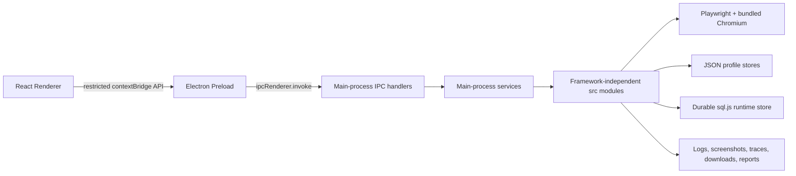
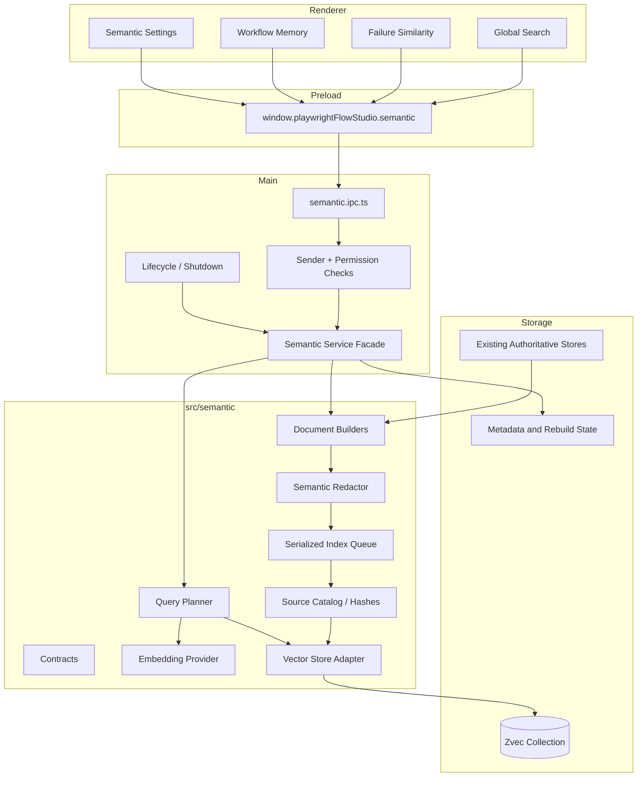
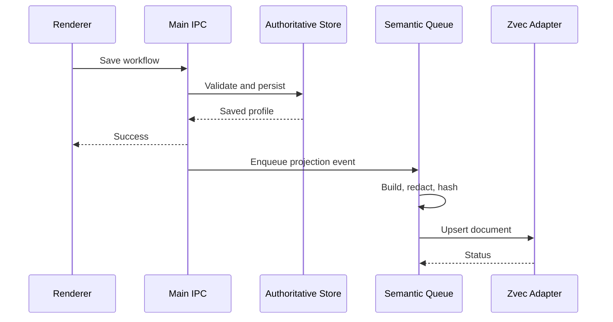
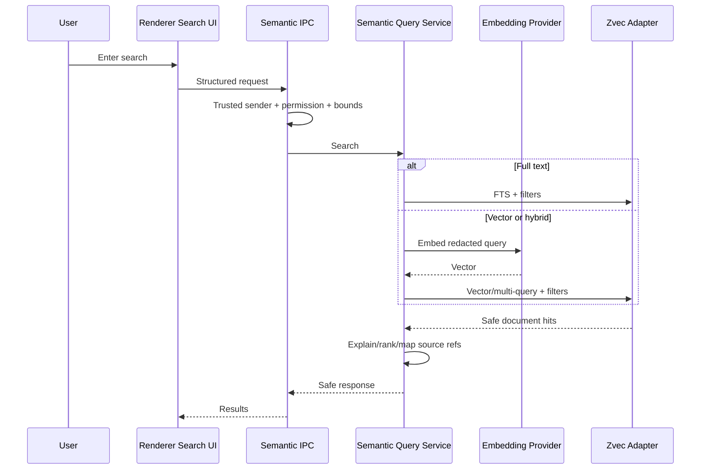
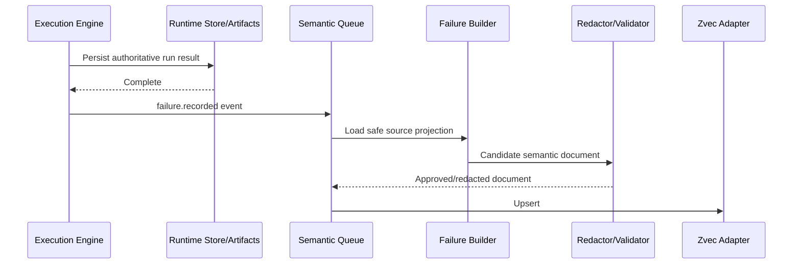
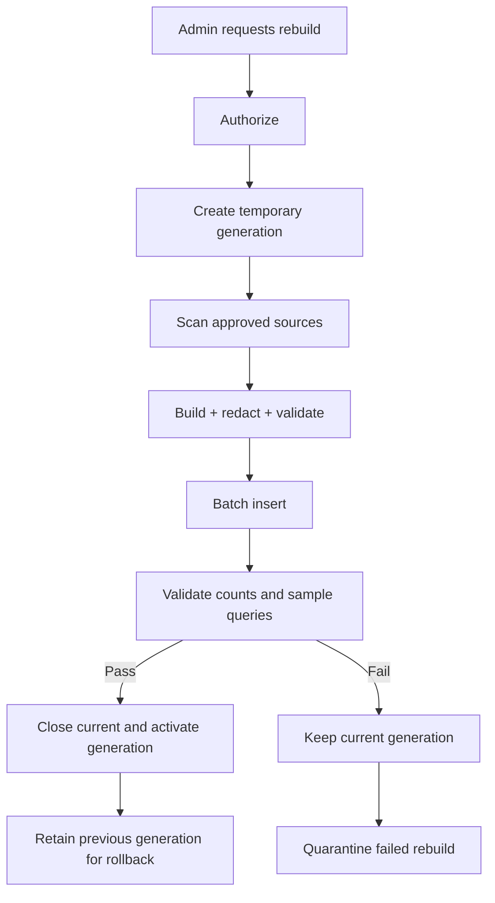

# AWKIT Target Architecture and Zvec Integration Plan

**Repository:** `MohammadAbwini98/AWKIT`  
**Product:** SpecterStudio / AWKIT  
**Document type:** Target architecture and phased implementation plan  
**Prepared:** 2026-07-24  
**Status:** Proposed architecture — implementation requires the phase gates defined below  
**Review status:** Round 1 review complete (2026-07-24) — **APPROVE PHASE 0 WITH CORRECTIONS**. All Round 1 corrections are applied to this document. See §2.1 for the correction log.

---

## 1. Executive Summary

AWKIT is an offline-capable Windows desktop application for visually designing and executing authorized Playwright web automations. Its current architecture already has strong separation between:

- the Electron main process;
- the sandboxed React renderer;
- the restricted preload/IPC contract;
- framework-independent automation, orchestration, data, security, and reporting modules under `src/`;
- JSON profile stores for authoring data;
- a durable `sql.js` runtime store for execution state and observability;
- bundled Chromium and strict offline packaging;
- concurrency, resource admission, cancellation, recovery, security, and protected-login controls.

The recommended architecture **preserves all of those boundaries**. Zvec is introduced as an **optional, local, rebuildable semantic retrieval subsystem**, not as a replacement for AWKIT's workflow engine, profile stores, runtime database, security store, licensing store, or deterministic locator logic.

The target relationship is:

```text
Authoritative AWKIT stores
        │
        │ sanitized domain projections
        ▼
Rebuildable semantic index
        │
        ├── full-text search
        ├── structured filtering
        ├── failure similarity
        ├── workflow discovery
        ├── locator memory
        └── optional local AI context
```

### Core recommendation

1. Keep existing JSON and SQLite-based stores authoritative.
2. Add Zvec behind a new `SemanticIndexService` in the main-process backend.
3. Start with full-text search only; do not require an embedding model initially.
4. Add embeddings later through a provider abstraction and only after offline packaging, security, and performance gates pass.
5. Make all semantic capabilities optional and non-blocking: AWKIT must continue designing and executing workflows if Zvec is unavailable.
6. Never expose Zvec or native modules directly to the renderer.
7. Treat semantic data as potentially readable local data and apply strict redaction before indexing.
8. Prove the native Node binding in packaged Electron before integrating it into product features.

---

## 2. Repository Baseline and Documentation Authority

The repository currently contains both current and historical descriptions. Some documents retain earlier product names or architecture statements. Implementation work should use this authority order:

1. **Current source code and package configuration**
2. **`docs/ai/CURRENT_STATE.md`**
3. **`docs/ai/ARCHITECTURE.md`**
4. **`AGENTS.md` and `docs/ai/RULES.md`**
5. **Feature-specific current documentation**
6. **Historical phase plans, change requests, and older project briefs**

Examples of known documentation drift that should be corrected during this program:

- Some documents use WebFlow Studio while the current package identifies SpecterStudio.
- Some historical documents describe JSON-only persistence while the runtime now has durable `sql.js` SQLite storage.
- Some documentation references React Flow even though the current dependency and canvas implementation must be verified from source before changing canvas code.
- The internal preload API identifier must remain `window.playwrightFlowStudio`, regardless of product branding.
- This plan's original draft assumed a five-role authorization model including a "Designer" role. The actual built-in role set, defined in `src/security/authz/Permissions.ts`, is exactly four roles: `SuperUser`, `Administrator`, `Operator`, `Viewer`. There is no `Designer` role anywhere in the codebase. Corrected in §10.

This plan uses **AWKIT** for the repository/system and **SpecterStudio** for the packaged product where a distinction is useful.

## 2.1 Review Round 1 — Corrections Applied (2026-07-24)

An independent review compared this plan line-by-line against the current repository and returned **APPROVE PHASE 0 WITH CORRECTIONS**. The following corrections are incorporated into this document:

1. **RBAC (§10):** removed the nonexistent `Designer` role; the permission table now uses only the real built-in roles (`SuperUser`, `Administrator`, `Operator`, `Viewer`); new semantic permissions are specified as extensions to `src/security/authz/Permissions.ts` using the repository's existing dot-case convention; `SENSITIVE_PERMISSIONS` inclusion is decided explicitly rather than left silent.
2. **Process placement (§6.3):** main-process placement is no longer the predetermined choice. Phase 0 must produce comparative data for main-process lazy-loading vs. an Electron utility process before Phase 1 begins.
3. **Shutdown lifecycle (§16.3):** clarified how semantic shutdown composes with the existing shared 2-second `before-quit` budget in `app/main/main.ts`, instead of silently adding another operation to it.
4. **Windows native-binary risk (§19, §30):** added Windows Defender / antivirus / SmartScreen quarantine as an explicit, named risk with a required Phase 0 test on a normal non-admin Windows account, reported truthfully for the exact environment tested (not generalized as universal compatibility).
5. **UI rules (§22):** made the existing Hologram design-token requirement (`--awkit-*`, `--space-*`, `--radius-*`, motion/shadow tokens; no parallel styling system) explicit for semantic UI surfaces.
6. **Phase 0 packaging method (§19, §25):** Phase 0 must run inside an isolated branch or worktree using AWKIT's real `electron-vite`/`electron-builder` pipeline (with minimal temporary changes to `package.json`, `package-lock.json`, `electron-builder.json`, dependency-manifest generation, and offline validation confined to that branch) — a standalone throwaway packaging configuration is insufficient, because it cannot prove the real app's externalization, ASAR-unpacking, optional-dependency, or offline-manifest behavior.
7. **Phase 0 proof matrix (§19.2):** expanded to the full validation matrix in the new §19.3.
8. **Architecture wording (§4, §9.4, §11):** already correctly stated Zvec as optional/derived/rebuildable/non-authoritative, no encryption claim, and an unchanged preload root — confirmed unchanged, no correction needed.
9. **Documentation consistency (this section):** this baseline now records the RBAC drift found during review, alongside the pre-existing WebFlow Studio / React Flow / JSON-only-persistence drift notes above.

No unrelated historical document was modified as part of this correction pass.

---

## 3. Goals

### 3.1 Product goals

- Preserve AWKIT's offline, adminless Windows deployment model.
- Improve discovery of workflows, flows, nodes, documentation, reports, and failures.
- Reuse successful automation knowledge without weakening deterministic execution safety.
- Enable meaningful failure similarity and historical recommendations.
- Prepare a safe foundation for optional local AI assistance.
- Keep all current features functional when semantic indexing is disabled.
- Avoid changing existing workflow backend logic unless required to emit safe indexing events.
- Add features through narrow interfaces rather than broad refactors.

### 3.2 Architecture goals

- Preserve renderer/main/core separation.
- Keep source-of-truth ownership explicit.
- Add a single-writer semantic subsystem with serialized mutations.
- Make the index rebuildable from authoritative stores.
- Isolate vendor-specific APIs behind AWKIT-owned interfaces.
- Support schema/version migration through rebuild rather than complex in-place migration where possible.
- Make security, authorization, observability, packaging, and recovery first-class.
- Avoid blocking workflow execution on indexing.
- Allow future replacement of Zvec without rewriting UI or domain code.

### 3.3 Operational goals

- No runtime downloads.
- No internet requirement.
- No external database or local server.
- No administrator rights.
- No global Node, Python, Java, Playwright, Chromium, or model dependency for semantic search.
- Predictable storage under `%LOCALAPPDATA%\SpecterStudio`.
- Clear status and recovery controls in Settings/System.
- Dependency-manifest and checksum coverage for all native assets.

---

## 4. Non-Goals

The Zvec program must not:

- replace `JsonProfileStore`;
- replace the durable runtime SQLite store;
- become authoritative for workflow definitions or execution status;
- store passwords, tokens, cookies, session state, private keys, license signatures, Oracle credentials, or raw secret-bearing payloads;
- bypass CAPTCHA, MFA, protected login, bot detection, rate limits, or authorization controls;
- allow AI or similarity search to execute a browser action without deterministic validation;
- require an online embedding API in packaged offline mode;
- add a background server or listening network port;
- modify the workflow canvas engine as part of semantic search;
- change the internal preload root name;
- introduce cloud telemetry;
- auto-repair workflows without explicit user review and validation;
- compile Zvec from source on the end-user machine.

---

## 5. Current AWKIT Architecture

## 5.1 Process model



### Renderer

Responsibilities:

- application shell and navigation;
- workflow and flow authoring;
- settings and administration views;
- execution monitoring;
- reports and analytics;
- read-only presentation of semantic search results;
- user-reviewed semantic recommendations.

Restrictions:

- no direct Node filesystem access;
- no direct native module access;
- no direct Zvec access;
- no unrestricted `ipcRenderer`;
- no secret-store access;
- no authorization decisions.

### Preload

Responsibilities:

- expose the existing restricted `window.playwrightFlowStudio` contract;
- serialize safe request and response data;
- avoid exposing Electron primitives;
- provide narrow semantic methods after implementation.

### Main process

Responsibilities:

- application lifecycle;
- trusted-sender enforcement;
- IPC authorization;
- storage and service ownership;
- offline startup gate;
- security and licensing services;
- Oracle bridge lifecycle;
- semantic index lifecycle;
- shutdown flushing and resource disposal.

### Framework-independent core

Responsibilities:

- workflow and flow models;
- orchestration;
- execution;
- locators, waits, connectors, retry and safety policy;
- data-source resolution;
- concurrency, admission, locks, cancellation, and recovery;
- runtime artifacts and observability;
- semantic contracts and document-building logic that do not require Electron.

---

## 5.2 Existing authoritative stores

| Domain | Current authority | Semantic treatment |
|---|---|---|
| Flow definitions | JSON `FlowProfile` files | Derived searchable projection |
| Workflow definitions | JSON `WorkflowProfile` files | Derived searchable projection |
| Data-source definitions | JSON profiles / Oracle profiles | Metadata only; no credentials or row values by default |
| Runtime inputs | JSON profiles | Names/schema only; values excluded by default |
| Execution state | Durable runtime SQLite | Aggregated sanitized projection |
| Reports | Existing report store/files | Sanitized searchable projection |
| Logs and evidence | Files and durable references | Selected masked summaries only |
| User identities and roles | Security store | Never copied into semantic index except non-sensitive actor class if required |
| Sessions | Session profiles and browser storage state | Never indexed |
| Secrets | Secret store / DPAPI-backed vaults | Never indexed |
| Licensing | Licensing store | Never indexed |
| Settings | Settings store | Only semantic feature configuration is read by the service |
| Branding | Branding store | Not indexed |
| Oracle credentials | Secret vault | Never indexed |
| Oracle query results | Runtime data | Excluded by default; explicit future opt-in only |

---

## 6. Target Architecture

## 6.1 Logical component diagram



---

## 6.2 Architectural principle: adapter first

No AWKIT feature should import `@zvec/zvec` directly except the Zvec adapter.

```typescript
export interface SemanticStore {
  initialize(options: SemanticStoreInitializeOptions): Promise<SemanticStoreStatus>;
  upsert(documents: SemanticDocument[]): Promise<SemanticMutationResult>;
  delete(documentIds: string[]): Promise<SemanticMutationResult>;
  query(request: SemanticQueryRequest): Promise<SemanticQueryResult>;
  getStats(): Promise<SemanticStoreStats>;
  optimize(options?: SemanticOptimizeOptions): Promise<void>;
  close(): Promise<void>;
}
```

The concrete implementation:

```text
ZvecSemanticStore implements SemanticStore
```

Benefits:

- Zvec API changes stay localized.
- Unit tests can use an in-memory fake.
- AWKIT can disable semantic features without loading the native module.
- A different embedded search engine can be evaluated later.
- Main-process and renderer contracts remain vendor-neutral.

---

## 6.3 Recommended process placement

### Review Round 1 correction

Main-process placement is **not** a predetermined choice. AWKIT currently has zero in-process native `.node` addons: Playwright drives an out-of-process browser, `sql.js` is pure WebAssembly specifically to avoid native-binary Windows packaging risk, and the Oracle JDBC bridge is a deliberately separate Java **child process** communicating over stdio precisely to isolate ABI/crash/lifecycle risk from the main process. Zvec's native `.node` binding would be the first exception to that pattern. Given that precedent, Phase 0 must produce comparative data for both candidate placements below before Phase 1 commits to one — see §19.3 for the required measurements.

### Option A — Electron main process (lazy-loaded)

Load Zvec lazily in the Electron main process through `SemanticServiceFacade`.

Reasons in favor:

- minimal integration change;
- natural access to authoritative stores;
- existing single-instance policy;
- straightforward IPC authorization;
- no additional process protocol during the compatibility spike.

Reasons for caution:

- a native addon crash can take down the main process and the whole app;
- no existing AWKIT precedent for an in-process native addon (see above).

### Option B — Electron utility process

Host Zvec inside an Electron `utilityProcess`, behind the same `SemanticStore` adapter interface so renderer and domain code are unaffected by the choice.

Reasons in favor:

- native-addon crash isolation from the main process (mirrors the Oracle bridge's isolation rationale);
- indexing/optimization CPU load does not compete with the main event loop;
- cleaner shutdown/lifecycle boundary.

Reasons for caution:

- additional process-lifecycle and IPC-relay complexity;
- an extra packaging/offline surface to validate.

### Phase 0 decision requirement

Phase 0 must benchmark both options (§19.3) and record startup time, query latency, indexing throughput, RSS, Electron event-loop responsiveness, shutdown behavior, failure containment, and packaging complexity for each. The placement decision must be made and recorded (as an ADR, §31) **before** Phase 1 begins. Only if Phase 0 data is inconclusive may Option A ship first with utility-process migration deferred to Phase 6 under the original measurement-driven trigger list:

- native addon crash can terminate the main process;
- indexing causes main-loop latency;
- collection optimization consumes unacceptable CPU;
- memory isolation is operationally valuable;
- native lifecycle conflicts with Electron shutdown;
- heavy future embeddings should not share the main process.

---

## 7. Semantic Domain Model

## 7.1 Semantic document

```typescript
export type SemanticDocumentKind =
  | "workflow"
  | "flow"
  | "node-template"
  | "locator-success"
  | "locator-failure"
  | "run-failure"
  | "run-summary"
  | "documentation";

export interface SemanticDocument {
  id: string;
  kind: SemanticDocumentKind;

  entityId: string;
  revision: string;
  sourceHash: string;
  schemaVersion: number;

  title: string;
  content: string;
  tags: string[];

  workflowId?: string;
  flowId?: string;
  nodeId?: string;
  nodeType?: string;
  hostname?: string;
  outcome?: "success" | "failure" | "cancelled" | "unknown";
  errorCategory?: string;

  createdAt: string;
  updatedAt: string;

  embedding?: Float32Array;
  embeddingProviderId?: string;
  embeddingVersion?: string;
}
```

### Rules

- `id` must be deterministic.
- `sourceHash` detects stale projections.
- `revision` records the source revision, not the index revision.
- `content` must already be redacted.
- vectors are optional.
- the index schema version is independent of AWKIT's profile and runtime database versions.
- query results return source references, not full authoritative objects.

---

## 7.2 Deterministic document IDs

Recommended forms:

```text
workflow:<workflowId>:<revision>
flow:<flowId>:<revision>
locator-success:<workflowId>:<flowId>:<nodeId>:<contextHash>
locator-failure:<runId>:<attemptId>:<nodeId>
run-failure:<runId>:<attemptId>:<nodeId>
run-summary:<runId>
documentation:<relativePath>:<contentHash>
node-template:<nodeType>:<templateVersion>
```

IDs must use the existing path/identifier sanitization utilities where filesystem interaction is involved.

---

## 7.3 Zvec collection strategy

Use one primary collection initially:

```text
awkit-memory-v1
```

Reasons:

- cross-kind search is important;
- unified filters can limit `kind`;
- fewer lifecycle and migration operations;
- simpler rebuild and status reporting;
- hybrid queries can rank workflows, failures, and documentation together when requested.

Potential future split:

- `awkit-authoring-memory`
- `awkit-runtime-memory`
- `awkit-documentation-memory`

A split should occur only when retention, size, permissions, or query patterns require it.

---

## 7.4 Proposed Zvec scalar schema

| Field | Type | Purpose |
|---|---|---|
| `kind` | string | Document category |
| `entityId` | string | Authoritative entity identifier |
| `revision` | string | Source revision |
| `sourceHash` | string | Staleness detection |
| `schemaVersion` | integer | Semantic schema |
| `title` | string | Display title |
| `content` | string | Redacted searchable text |
| `tags` | string array | Search and filtering |
| `workflowId` | string nullable | Workflow filter |
| `flowId` | string nullable | Flow filter |
| `nodeId` | string nullable | Node filter |
| `nodeType` | string nullable | Node-type filter |
| `hostname` | string nullable | Safe origin-level grouping |
| `outcome` | string nullable | Runtime result |
| `errorCategory` | string nullable | Failure grouping |
| `createdAt` | string | ISO timestamp |
| `updatedAt` | string | ISO timestamp |
| `embeddingProviderId` | string nullable | Vector provenance |
| `embeddingVersion` | string nullable | Vector compatibility |

Initial indexes:

- full-text index on `content`;
- full-text or keyword support on `title`;
- inverted indexes for `kind`, `workflowId`, `flowId`, `nodeType`, `hostname`, `outcome`, and `errorCategory`;
- no vector index in Phase 1.

Future vector schema:

```text
embedding: VECTOR_FP32
metric: COSINE
index: HNSW or FLAT based on measured corpus size
dimension: supplied by EmbeddingProvider
```

Do not choose HNSW parameters before corpus benchmarks.

---

## 8. Indexable Content Policy

## 8.1 Workflow documents

Include:

- workflow name and description;
- referenced flow names;
- connector kinds;
- configured run behavior;
- safe tags;
- node-type summary;
- sanitized hostnames;
- non-secret data-source names and types;
- historical success/failure aggregates when available.

Exclude:

- runtime input values;
- credential references;
- secret identifiers that reveal sensitive context;
- full URLs containing queries or path tokens;
- raw Oracle SQL unless explicitly classified safe;
- browser session references.

---

## 8.2 Flow documents

Include:

- flow name and description;
- ordered node labels and types;
- connector structure;
- waits and retry intent;
- locator strategy descriptions without sensitive values;
- expected outputs by name/type;
- safe navigation hostnames.

Exclude:

- entered passwords;
- secret-backed node values;
- cookies, headers, tokens, and session material;
- full captured page text;
- unsafe form values.

---

## 8.3 Locator memory

Include:

- primary locator type;
- alternative locator types;
- ARIA role;
- accessible-name fingerprint after redaction;
- nearby label/title text after redaction;
- page hostname;
- frame/dialog/card/table/list context;
- success/failure outcome;
- resolution strategy;
- elapsed-resolution bucket;
- stable DOM structural features;
- app/site classification when user-defined and non-sensitive.

Exclude:

- raw full DOM;
- input values;
- hidden fields;
- session attributes;
- authentication tokens;
- arbitrary page text;
- full URL query parameters.

Locator memory is advisory. The runtime must still:

1. try the authored locator;
2. try authored alternatives;
3. apply existing deterministic context scoping;
4. retrieve memory candidates only after configured failure conditions;
5. validate uniqueness and visibility;
6. respect step safety metadata;
7. report that semantic memory influenced the candidate;
8. require user review before persisting any repair.

---

## 8.4 Failure documents

Include:

- masked error message;
- error classification;
- step type;
- locator diagnostic summary;
- attempt number;
- retry decision;
- browser/page liveness result;
- wait type;
- hostname;
- resource condition category;
- whether a similar retry previously succeeded;
- references to evidence files, not evidence contents;
- safe remediation notes.

Exclude:

- raw HTML;
- screenshot pixels;
- accessibility snapshots containing unreviewed page content;
- console/network bodies;
- headers;
- cookies;
- secret-bearing URLs;
- unmasked notes.

Failure evidence remains in its authoritative artifact store. Zvec stores a concise masked projection.

---

## 8.5 Documentation documents

Include committed, approved local documents such as:

- node help;
- architecture;
- verified commands;
- troubleshooting;
- security policy;
- offline packaging;
- feature descriptions;
- runbooks.

Exclude:

- `.env`;
- local agent scratchpads;
- secrets;
- user sessions;
- generated logs;
- unapproved private documents;
- files outside configured safe roots.

---

## 9. Redaction and Privacy Architecture

## 9.1 Central rule

No document reaches the semantic adapter until it passes through:

```text
SemanticDocumentBuilder
        │
        ▼
SemanticRedactor
        │
        ▼
SemanticPolicyValidator
        │
        ▼
Index queue
```

## 9.2 Redaction responsibilities

`SemanticRedactor` should compose or reuse existing AWKIT masking behavior and add semantic-specific controls:

- password/token/API-key patterns;
- authorization headers;
- cookie-like values;
- connection-string passwords;
- URL query and fragment removal;
- email and account identifiers according to configurable policy;
- long numeric identifiers;
- session/local-storage keys;
- custom user-defined sensitive terms;
- secret references;
- raw error notes;
- captured input values;
- bearer/basic credentials.

## 9.3 Policy validator

`SemanticPolicyValidator` rejects a document if:

- content exceeds the maximum size;
- prohibited fields are present;
- an unredacted secret pattern remains;
- the source kind is unsupported;
- the path is outside an approved root;
- an embedding dimension does not match the active schema;
- a required source reference is missing.

Rejection must never fail the originating workflow save or run completion. It creates a sanitized diagnostic and increments an indexing rejection metric.

## 9.4 Encryption position

Do not claim Zvec files are encrypted unless AWKIT adds and validates encryption.

Initial policy:

- store under the per-user runtime root;
- rely on Windows user-profile access controls;
- index only aggressively redacted content;
- add a Settings action to delete/rebuild the semantic index;
- document that local administrators may access files.

A later encryption layer requires a separate design because transparent encryption may conflict with memory mapping and index performance.

---

## 10. Authorization Model

### Review Round 1 correction

The original draft assumed a five-role model including a nonexistent `Designer` role. AWKIT's actual built-in roles, defined in `src/security/authz/Permissions.ts` (the single source of truth imported by both the main process and the renderer), are exactly: `SuperUser`, `Administrator`, `Operator`, `Viewer`. The table below is corrected to that real role set.

Proposed permissions — to be added to the `Permission` object in `src/security/authz/Permissions.ts`, following its existing dot-case string-value convention (e.g. `Permission.WORKFLOW_VIEW = "workflow.view"`), not as a parallel permission system:

```text
Permission.SEMANTIC_SEARCH                    = "semantic.search"
Permission.SEMANTIC_VIEW_FAILURE_SIMILARITY   = "semantic.viewFailureSimilarity"
Permission.SEMANTIC_MANAGE_INDEX              = "semantic.manageIndex"
Permission.SEMANTIC_MANAGE_EMBEDDINGS         = "semantic.manageEmbeddings"
Permission.SEMANTIC_EXPORT_DIAGNOSTICS        = "semantic.exportDiagnostics"
```

Corrected assignment (real roles only):

| Role | Search | Failure similarity | Rebuild/clear index | Embedding/model settings |
|---|---:|---:|---:|---:|
| Viewer | Optional (policy-configurable) | No | No | No |
| Operator | Yes | Yes, for reports the Operator is already permitted to view | No | No |
| Administrator | Yes | Yes | Yes | Yes |
| SuperUser | Yes | Yes | Yes | Yes |

Note: this repository's `Administrator` role is deliberately withheld from user administration and licensing (`ADMINISTRATOR_PERMISSIONS` in `Permissions.ts` excludes `USER_MANAGE`, `PAGE_LICENSE`, and all `license.*`/branding permissions). Semantic index management does not carry the same sensitivity as licensing/user management, so granting it to `Administrator` is consistent with that existing split — but this is a product decision to confirm during Phase 1, not assume.

### Sensitive-permission decision (must be made explicitly, not left silent)

`SENSITIVE_PERMISSIONS` in `Permissions.ts` currently forces re-authentication for user management, all licensing mutations, settings edits, and branding changes. Rebuild and clear are destructive/irreversible-in-effect admin actions in a similar spirit. **Phase 1 must explicitly decide** whether `SEMANTIC_MANAGE_INDEX` and/or `SEMANTIC_MANAGE_EMBEDDINGS` join `SENSITIVE_PERMISSIONS`. This plan does not resolve that decision; it is recorded as an open item (see the unresolved-decisions summary accompanying this review round).

Authorization must occur in the main-process IPC handler before:

- service initialization that reveals system information;
- collection access;
- source existence checks;
- rebuild operations;
- model path validation;
- diagnostics export.

Trusted-sender validation remains mandatory for every channel.

---

## 11. IPC and Preload Contract

## 11.1 Preload namespace

Add a narrow namespace without renaming the root:

```typescript
window.playwrightFlowStudio.semantic = {
  getStatus(): Promise<SemanticStatusView>;
  search(request: SemanticSearchRequest): Promise<SemanticSearchResponse>;
  similarFailures(request: SimilarFailureRequest): Promise<SimilarFailureResponse>;
  suggestLocators(request: LocatorSuggestionRequest): Promise<LocatorSuggestionResponse>;
  rebuild(request: SemanticRebuildRequest): Promise<SemanticAdminResponse>;
  cancelRebuild(): Promise<SemanticAdminResponse>;
  clear(): Promise<SemanticAdminResponse>;
  getSettings(): Promise<SemanticSettingsView>;
  updateSettings(request: SemanticSettingsPatch): Promise<SemanticAdminResponse>;
};
```

## 11.2 IPC channels

```text
semantic:getStatus
semantic:search
semantic:similarFailures
semantic:suggestLocators
semantic:rebuild
semantic:cancelRebuild
semantic:clear
semantic:getSettings
semantic:updateSettings
```

## 11.3 Contract rules

- requests use bounded strings and arrays;
- `topK` has a strict maximum;
- filters are structured objects, not raw Zvec expressions from the renderer;
- no renderer-supplied collection path;
- no renderer-supplied filesystem path except through approved browse/settings flows;
- no raw native error crosses IPC;
- results contain safe summaries and authoritative entity references;
- all channels return stable reason codes;
- query cancellation should be supported when practical;
- rebuild progress is surfaced through polling or a bounded event subscription.

---

## 12. Query Architecture

## 12.1 Query modes

```typescript
export type SemanticSearchMode =
  | "fullText"
  | "vector"
  | "hybrid";
```

Phase support:

| Phase | Full text | Vector | Hybrid |
|---|---:|---:|---:|
| Compatibility spike | Test only | Test fixture | Test fixture |
| Phase 1 | Yes | No | No |
| Failure memory | Yes | Optional experimental | No |
| Local embeddings | Yes | Yes | Yes |

## 12.2 Structured query request

```typescript
export interface SemanticSearchRequest {
  text: string;
  mode?: SemanticSearchMode;
  kinds?: SemanticDocumentKind[];
  workflowId?: string;
  flowId?: string;
  nodeType?: string;
  hostname?: string;
  outcome?: string;
  errorCategory?: string;
  topK?: number;
  groupBy?: "kind" | "workflowId" | "errorCategory" | "hostname";
}
```

The service builds vendor-specific filters internally. The renderer never sends a raw filter expression.

## 12.3 Ranking

Initial full-text ranking uses Zvec's FTS score and deterministic boosts:

- exact title match;
- current workflow match;
- current hostname match;
- same node type;
- recent failure;
- repeated historical resolution;
- user-pinned template.

Future hybrid ranking should use reciprocal-rank fusion or measured weighted fusion. Do not invent a permanent weighting formula before offline benchmark data exists.

## 12.4 Result object

```typescript
export interface SemanticSearchHit {
  documentId: string;
  kind: SemanticDocumentKind;
  entityId: string;
  title: string;
  summary: string;
  score: number;
  workflowId?: string;
  flowId?: string;
  nodeId?: string;
  hostname?: string;
  updatedAt: string;
  reasons: string[];
}
```

`reasons` must be explainable, for example:

- `"Title exact match"`
- `"Same node type"`
- `"Similar masked error"`
- `"Previously resolved by alternate role locator"`

Do not expose opaque AI confidence as certainty.

---

## 13. Embedding Architecture

## 13.1 Provider interface

```typescript
export interface EmbeddingProvider {
  readonly id: string;
  readonly version: string;
  readonly dimension: number;
  readonly executionMode: "local" | "remote";

  initialize(): Promise<void>;
  embed(texts: readonly string[], signal?: AbortSignal): Promise<Float32Array[]>;
  dispose(): Promise<void>;
}
```

Implementations:

```text
DisabledEmbeddingProvider
LocalOnnxEmbeddingProvider
RemoteEmbeddingProvider (development/explicit online mode only)
```

## 13.2 Offline enforcement

In packaged offline production:

- remote providers are rejected;
- network model downloads are rejected;
- model files must be bundled or selected from a local approved path;
- model checksums must be validated;
- model license and third-party notices must ship;
- missing model disables vector search without disabling FTS;
- no automatic fallback to a remote API.

## 13.3 Embedding versioning

The active semantic metadata must record:

```json
{
  "providerId": "local-onnx",
  "modelId": "model-name",
  "modelVersion": "x.y",
  "dimension": 384,
  "normalizationVersion": 1,
  "contentBuilderVersion": 2
}
```

Any incompatible change triggers a controlled rebuild.

## 13.4 Model selection gate

Do not select a model merely because it is small. Evaluate:

- Windows x64 support;
- CPU-only latency;
- memory use;
- license;
- offline redistribution rights;
- multilingual needs;
- embedding quality for automation errors and DOM/locator descriptions;
- package-size impact;
- behavior with English and Arabic text if required;
- deterministic model loading;
- compatibility with the Electron Node runtime.

---

## 14. Indexing Event Architecture

## 14.1 Non-blocking event flow



The authoritative save response must not wait for semantic indexing.

## 14.2 Event types

```typescript
export type SemanticIndexEvent =
  | { type: "workflow.saved"; workflowId: string }
  | { type: "workflow.deleted"; workflowId: string }
  | { type: "flow.saved"; flowId: string }
  | { type: "flow.deleted"; flowId: string }
  | { type: "run.completed"; runId: string }
  | { type: "failure.recorded"; runId: string; attemptId: string }
  | { type: "locator.resolved"; locatorMemoryId: string }
  | { type: "documentation.changed"; relativePath: string }
  | { type: "reconcile.requested"; scope: SemanticRebuildScope };
```

## 14.3 Queue behavior

Use a serialized, failure-isolated queue similar to existing AWKIT serial-write patterns.

Requirements:

- one mutation writer;
- bounded queue;
- duplicate-event coalescing;
- source re-read at execution time;
- cancellation for rebuild;
- retry only for safe transient storage errors;
- no unbounded retry loop;
- shutdown flush with a bounded timeout;
- observable queue depth and last error;
- disk-full handling;
- no exception propagation to workflow execution.

## 14.4 Reconciliation

Incremental events are not enough. Add:

- startup lightweight reconciliation;
- manual full rebuild;
- per-kind rebuild;
- stale-document cleanup;
- source-hash comparison;
- orphan deletion;
- schema-version detection.

A full rebuild should use a temporary collection:

```text
awkit-memory-v1.rebuild-<id>
```

After successful validation:

1. close the active collection;
2. atomically switch metadata to the new collection;
3. retain the previous collection as a short-lived rollback backup;
4. delete the backup after the retention window.

If Zvec cannot support safe rename/swap semantics for the collection directory, use an active-generation pointer in metadata and open by generation.

---

## 15. Runtime Storage Layout

Add a runtime folder such as:

```text
%LOCALAPPDATA%\SpecterStudio\semantic-index\
```

Proposed layout:

```text
semantic-index\
  metadata.json
  settings.json
  active-generation.json
  generations\
    gen-000001\
      <zvec collection files>
    gen-000002\
      <zvec collection files>
  rebuild\
    state.json
  quarantine\
    corrupt-<timestamp>\
  diagnostics\
    last-health-check.json
```

### Metadata example

```json
{
  "semanticSchemaVersion": 1,
  "activeGeneration": "gen-000001",
  "storeAdapter": "zvec",
  "storeVersion": "0.6.0",
  "ftsEnabled": true,
  "vectorEnabled": false,
  "embedding": null,
  "lastSuccessfulRebuildAt": null,
  "lastIncrementalUpdateAt": null
}
```

### Rules

- never write inside `resources`, `vendor`, or `app.asar`;
- use existing safe-path utilities;
- all metadata writes must be atomic;
- collection paths are generated by AWKIT, not user input;
- clearing the index must not touch authoritative data;
- corrupted generations are quarantined, not silently discarded.

---

## 16. Lifecycle

## 16.1 Startup

```text
Electron app ready
  └─ ensure runtime folders
      └─ offline startup gate
          └─ register IPC
              └─ initialize semantic facade in disabled/lazy state
```

Do not load the native module during early startup unless semantic search is enabled and startup measurements approve eager loading.

Recommended lazy triggers:

- first semantic search;
- explicit status health check;
- background indexing after the main window is ready;
- manual rebuild.

## 16.2 Initialization states

```typescript
type SemanticLifecycleState =
  | "disabled"
  | "notInitialized"
  | "initializing"
  | "ready"
  | "degraded"
  | "rebuilding"
  | "failed"
  | "closing"
  | "closed";
```

## 16.3 Shutdown

Before quit:

1. stop accepting rebuild requests;
2. cancel optional background document generation;
3. flush the mutation queue with a strict timeout;
4. persist rebuild state;
5. close the active collection;
6. dispose the embedding provider;
7. continue application shutdown even if semantic cleanup fails;
8. record a safe diagnostic for next startup.

### Review Round 1 correction — composing with the existing shutdown budget

`app/main/main.ts` already runs a bounded `before-quit` disposal sequence today:

```text
Promise.race(
  [Promise.all([flushSettingsWrites(), disposeOracleServices(), disposeSecurityKernel()])],
  timeout(2000ms)
).finally(() => app.quit())
```

Semantic shutdown must **not** be silently appended as a fourth entry sharing that same 2000 ms envelope without an explicit decision, because three operations (settings flush, Oracle Java-process disposal, security-kernel disposal) already share that budget today. Phase 0 must measure actual semantic close/flush duration under realistic queue depth. Phase 1 must then define, explicitly:

- the **total** shutdown budget once semantic disposal is included (keep the existing 2000 ms envelope only if Phase 0's measured close/flush duration fits comfortably inside it; otherwise size a new explicit budget);
- per-service behavior within that budget — semantic cleanup failing or timing out must never prevent `app.quit()`, matching the existing pattern where the `Promise.race` timeout always wins and the quit proceeds regardless.

Semantic shutdown should be added to the existing bounded `before-quit` disposal sequence **only under an explicit, measured budget decision**, not by default.

---

## 17. Failure and Recovery Model

| Failure | Required behavior |
|---|---|
| Native module fails to load | Mark semantic feature unavailable; AWKIT continues |
| Windows binding missing | Offline validator blocks release; runtime shows actionable error |
| Dictionary assets missing | Health check fails; no silent partial operation |
| Collection missing | Create or request rebuild |
| Schema mismatch | Rebuild to a new generation |
| Corrupt collection | Quarantine and rebuild |
| Disk full | Stop indexing, preserve source data, show status |
| Query failure | Return safe error, no renderer crash |
| Rebuild cancelled | Keep current generation active |
| Rebuild crashes | Resume or discard temporary generation; current generation remains |
| Embedding model missing | Disable vector/hybrid; FTS remains available |
| Wrong vector dimension | Reject vector document and require rebuild |
| Queue overflow | Coalesce or drop low-priority events, schedule reconciliation |
| App terminates during write | Rely on collection durability plus generation metadata recovery |
| Permission denied | No path leakage; surface reason code |
| Native process crash | If utility-process mode is later used, restart with bounded policy |

Semantic failure is never allowed to:

- corrupt a flow/workflow save;
- fail a workflow run;
- change a retry decision;
- suppress failure evidence;
- block application startup unless the feature is explicitly configured as mandatory in a future enterprise policy.

The initial implementation must not offer a mandatory mode.

---

## 18. Packaging and Offline Architecture

## 18.1 Native package implications

Zvec's Node package includes:

- JavaScript/TypeScript entry points;
- a native `.node` binding;
- a Windows x64 binding package;
- tokenizer dictionary files.

AWKIT currently externalizes main-process dependencies and uses an explicit Electron Builder file list. Therefore, adding the npm dependency is insufficient.

## 18.2 Required packaging changes

The final implementation must explicitly package and unpack:

```text
node_modules/@zvec/zvec/**
node_modules/@zvec/bindings-win32-x64/**
node_modules/bindings/**
zvec_node_binding.node
jieba_dict/jieba.dict.utf8
jieba_dict/hmm_model.utf8
```

Illustrative configuration only:

```json
{
  "files": [
    "out/**",
    "package.json",
    "node_modules/sql.js/dist/sql-wasm.js",
    "node_modules/sql.js/dist/sql-wasm.wasm",
    "node_modules/@zvec/zvec/**",
    "node_modules/@zvec/bindings-win32-x64/**",
    "node_modules/bindings/**"
  ],
  "asarUnpack": [
    "node_modules/playwright/**",
    "node_modules/playwright-core/**",
    "node_modules/@zvec/zvec/**/*.node",
    "node_modules/@zvec/zvec/jieba_dict/**",
    "node_modules/@zvec/bindings-win32-x64/**"
  ]
}
```

The exact layout must be verified from the built application; it must not be accepted by configuration inspection alone.

## 18.3 Dependency preparation

- install optional dependencies explicitly;
- pin exact versions through the lockfile;
- do not run a source build on the target machine;
- do not download a binary at runtime;
- include the binding in offline preparation and vendor validation;
- include third-party license notices;
- include hashes and sizes in the dependency manifest.

## 18.4 Offline manifest additions

The manifest should identify:

- npm package version;
- Windows binding package version;
- native binary SHA-256;
- dictionary file SHA-256 values;
- expected relative packaged paths;
- architecture `win32-x64`;
- semantic schema compatibility;
- optional embedding model artifacts and licenses.

## 18.5 Packaged startup validation

The startup gate or semantic health checker should verify:

- expected files exist;
- architecture matches;
- native module loads;
- dictionaries resolve;
- a test collection can be opened under the runtime root;
- no path resolves into a read-only packaged location;
- no runtime network access is attempted.

---

## 19. Native Compatibility Spike

This is a mandatory precondition.

### Review Round 1 correction — packaging method

A standalone, throwaway Electron packaging configuration is **not sufficient** to validate this spike, because the primary risks are dependency externalization, ASAR unpacking, optional native-binding inclusion, runtime path resolution, and offline-manifest enforcement — all of which are properties of AWKIT's *actual* build, not of a miniature test app. A separate small package could pass while the real AWKIT package still fails.

The spike must therefore run:

- inside an **isolated git branch or worktree** created specifically for this spike;
- using AWKIT's **real** `electron-vite.config.ts` and `electron-builder.json` build/packaging pipeline;
- with only the minimal temporary changes needed to add the Zvec dependency and its packaging entries (`package.json`, `package-lock.json`, `electron-builder.json` `files`/`asarUnpack`, dependency-manifest generation, offline validation) — confined entirely to that branch;
- adding **no** production semantic service, IPC channel, preload API, UI, or authoritative-data change (Phase 0 has no product feature, per §25);
- left fully disposable — the branch must be safely deletable on a **NO-GO** decision, and must not be merged without a separate explicit **GO** decision and a distinct Phase 1 review.

### 19.1 Spike implementation

Create a small isolated service and verifier (inside the isolated spike branch/worktree above) that:

1. imports `@zvec/zvec`;
2. initializes logging to an app-owned local folder;
3. creates a temporary FTS collection;
4. inserts at least 1,000 synthetic documents;
5. closes and reopens the collection;
6. runs async full-text queries;
7. creates a small vector fixture and runs a vector query;
8. verifies updates and deletes;
9. forces termination during writes and verifies recovery;
10. verifies dictionary discovery;
11. packages portable and NSIS builds through AWKIT's real `electron-builder.json` (temporarily extended in the spike branch, not a separate config);
12. launches each package offline;
13. verifies no runtime download or network dependency;
14. measures package size, startup, memory, insert throughput, and query latency;
15. runs the same 1–14 sequence hosting Zvec (a) lazily in the Electron main process and (b) inside an Electron `utilityProcess`, recording startup time, query latency, indexing throughput, RSS, Electron event-loop responsiveness, shutdown behavior, and failure containment for both, per §6.3's Phase 0 decision requirement;
16. tests the unpacked native `.node` binding under a normal **non-admin** Windows account with default Windows Defender/SmartScreen enabled, and records the exact environment (Windows build, Defender/AV state, code-signing status of the binary) and the exact observed result (allowed / quarantined / blocked / reputation-warned) — truthfully, without generalizing a single machine's result to universal compatibility;
17. deletes the temporary fixture safely.

### 19.2 Spike decision

**Pass** only when:

- development and packaged builds load the binding;
- portable and NSIS builds work, built through AWKIT's real packaging pipeline in the isolated spike branch;
- no Visual Studio/CMake/runtime compiler is needed on the target;
- no administrator right is needed;
- native assets are covered by the manifest;
- FTS persists across restart;
- app shutdown releases collection files;
- queries do not materially freeze the UI or execution IPC;
- missing native assets fail clearly;
- uninstall/portable cleanup rules are understood;
- the non-admin-account AV/SmartScreen test (item 16) completed and its exact result is recorded, whatever that result is;
- the main-process-vs-utility-process comparison (item 15) produced enough data to make the §6.3 placement decision.

**Fail or redesign** if:

- Electron ABI incompatibility cannot be solved using the shipped prebuilt;
- rebuilding requires unsupported production tooling;
- package validation cannot prove correct files;
- native crashes destabilize the app;
- licensing prevents redistribution;
- resource overhead is unacceptable;
- the native binary is reliably quarantined or blocked on a default non-admin Windows configuration with no accepted mitigation.

A failed spike does not affect existing AWKIT functionality, because it lives entirely on a disposable branch/worktree.

### 19.3 Phase 0 proof matrix

All of the following must be validated, covering both development and packaged execution, inside the isolated spike branch/worktree:

- Electron development runtime;
- unpacked packaged directory;
- portable Windows EXE;
- per-user NSIS installation;
- offline launch (no network reachable);
- non-admin launch;
- native binding present and loads;
- Jieba dictionaries present and correctly resolved next to the binding;
- collection created only under `%LOCALAPPDATA%\SpecterStudio\...` — never under `resources/`, `vendor/`, or `app.asar`;
- create / insert / FTS query / vector-fixture query / update / delete / close / reopen cycle;
- abrupt termination during a write, followed by restart and recovery;
- missing-binding negative case (clear failure, no crash, no silent partial operation);
- missing-dictionary negative case (health check fails clearly);
- read-only packaged-resource negative case (no attempted write into `resources/`/`app.asar`);
- optional-dependency-pruning negative case (npm optional dependency removed, feature disables cleanly);
- no runtime download or external/listening server at any point;
- dependency-manifest and checksum validation for the native binary and dictionary files;
- package-size delta (portable + NSIS) reported;
- cleanup and upgrade behavior (uninstall/portable relaunch does not orphan the semantic-index folder in a broken state).

---

## 20. Concurrency and Performance

## 20.1 Single-writer rule

All semantic mutations pass through one queue. This aligns with Zvec's single-process write constraints and AWKIT's existing single-instance design.

## 20.2 Query concurrency

Use asynchronous queries. Avoid synchronous operations on Electron's main thread for:

- large inserts;
- full rebuild;
- optimization;
- large queries;
- embedding generation.

If async native workers still cause main-loop pressure, move the adapter to a utility process.

## 20.3 Work priorities

Priority order:

1. user-visible search;
2. failure similarity requested by the user;
3. small incremental updates;
4. completed-run indexing;
5. documentation indexing;
6. optimization;
7. full rebuild.

Pause or throttle low-priority semantic work when:

- AWKIT execution backpressure is active;
- free-memory floor is approached;
- CPU is above configured threshold;
- browser crash rate is elevated;
- a large run is actively collecting evidence;
- shutdown begins.

Reuse current resource sampling and capacity signals rather than creating an independent machine monitor.

## 20.4 Proposed performance budgets

These are initial engineering targets, not claims:

- semantic-disabled startup regression: effectively zero;
- lazy native initialization: measured and reported;
- FTS query p95: under 300 ms at the agreed benchmark corpus;
- IPC search response: bounded top-K, default 20, hard maximum 100;
- incremental indexing: never blocks authoritative save/run completion;
- queue memory: bounded;
- rebuild: cancellable and progress-reporting;
- index disk size: reported in Settings;
- no unbounded content or vector payload;
- no synchronous optimization during active automation.

Final budgets should be set after the spike based on 10k, 100k, and 1M-document fixtures appropriate to AWKIT.

---

## 21. Observability

## 21.1 Status view

Expose:

```typescript
interface SemanticStatusView {
  enabled: boolean;
  lifecycleState: SemanticLifecycleState;
  storeAdapter: string;
  storeVersion?: string;
  activeGeneration?: string;
  ftsEnabled: boolean;
  vectorEnabled: boolean;
  embeddingProvider?: string;
  documentCount?: number;
  queueDepth: number;
  rebuildProgress?: {
    phase: string;
    completed: number;
    total?: number;
  };
  lastSuccessfulUpdateAt?: string;
  lastSuccessfulRebuildAt?: string;
  lastErrorCode?: string;
  indexPath?: string;
  diskBytes?: number;
}
```

Only authorized administrators should see physical paths.

## 21.2 Metrics

Track locally:

- query count and latency;
- zero-result rate;
- result click-through;
- documents inserted, updated, deleted, rejected;
- queue depth;
- rebuild duration;
- collection size;
- native initialization duration;
- model initialization and embedding latency;
- semantic fallback count;
- locator-suggestion validation success;
- failures by safe reason code.

Do not record query text if it may contain sensitive information. Prefer hashed/aggregated diagnostics or explicit opt-in.

## 21.3 Logging

- use existing masked logging;
- never log vectors;
- never log full indexed content;
- never log raw filters;
- log document IDs and safe kinds;
- log native errors after sanitization;
- bound logs and retention.

---

## 22. User Interface Architecture

### Review Round 1 correction — design tokens

Every semantic UI surface below (`SemanticSearch.tsx`, `SemanticSettings.tsx`, `GlobalSemanticSearch.tsx`, `SemanticResultList.tsx`, `SimilarFailuresPanel.tsx`, `LocatorSuggestionsPanel.tsx`, `SemanticHealthCard.tsx`) **must** resolve color, spacing, radius, shadow, and motion through the existing Hologram design tokens in `app/renderer/styles/global.css` (`var(--awkit-*)`, `--space-*`, `--radius-*`, `--awkit-motion-*`/`--awkit-dur-*`/`--awkit-ease-out`, `--awkit-shadow-*`) — no hardcoded hex colors, no arbitrary pixel spacing, and no parallel class system duplicating existing shared primitives (`MetricCard`, `EmptyState`, `SkeletonCard`, `.awkit-table`, `.modal-overlay`/`.modal-dialog`, `.toolbar-button`). This is a repository-wide, non-negotiable rule (`docs/ai/RULES.md` › UI), not specific to semantic search. None of this UI work may modify the global `.app-shell`/`.app-main` grid layouts.

## 22.1 Global search

Add a global search surface that can search:

- workflows;
- flows;
- node types/templates;
- documentation;
- failure history, subject to permission.

Results open the authoritative AWKIT entity or report. The semantic index never becomes an editor.

## 22.2 Failure similarity panel

Within execution reports:

- show top similar failures;
- explain matching factors;
- show prior outcome and safe resolution note;
- link to the original report if authorized;
- never state a recommendation as guaranteed;
- allow dismissing irrelevant matches.

## 22.3 Locator suggestions

Within locator diagnostics:

- show suggested locator candidates;
- show historical success count;
- show context match;
- allow test-only validation against the current page;
- require explicit user action to adopt;
- write changes to the authoritative flow only through the existing flow-save path.

## 22.4 Semantic settings

Recommended controls:

- Enable local semantic search
- Enable runtime failure indexing
- Enable locator memory
- Index documentation
- Search scope and retention
- Rebuild index
- Cancel rebuild
- Clear index
- Open index folder, admin only
- Show storage and document count
- Embedding provider, initially Disabled
- Local model path, future
- Health check

Follow existing design tokens and page/layout patterns. Do not create a parallel styling system.

---

## 23. Retention

Suggested defaults:

| Kind | Default retention |
|---|---|
| Workflow/flow projection | While source exists |
| Documentation | While source exists |
| Run summaries | Configurable, aligned with report retention |
| Failure memory | Configurable, for example most recent N or time window |
| Locator success memory | Bounded per site/node type/context |
| Locator failures | Shorter than successful memory |
| Deleted source tombstones | Until reconciliation completes |

Retention actions should delete semantic documents only. Authoritative artifact retention remains controlled by its existing subsystem.

---

## 24. Proposed Module and File Layout

```text
src/
  semantic/
    contracts/
      SemanticDocument.ts
      SemanticQuery.ts
      SemanticStatus.ts
      SemanticSettings.ts
      SemanticEvents.ts
    SemanticStore.ts
    ZvecSemanticStore.ts
    SemanticIndexService.ts
    SemanticQueryService.ts
    SemanticIndexQueue.ts
    SemanticDocumentCatalog.ts
    SemanticRedactor.ts
    SemanticPolicyValidator.ts
    SemanticContentNormalizer.ts
    SemanticGenerationManager.ts
    SemanticHealthCheck.ts
    EmbeddingProvider.ts
    DisabledEmbeddingProvider.ts
    builders/
      WorkflowSemanticDocumentBuilder.ts
      FlowSemanticDocumentBuilder.ts
      FailureSemanticDocumentBuilder.ts
      LocatorSemanticDocumentBuilder.ts
      DocumentationSemanticDocumentBuilder.ts
    sources/
      WorkflowSemanticSource.ts
      FlowSemanticSource.ts
      RuntimeSemanticSource.ts
      DocumentationSemanticSource.ts
    testing/
      InMemorySemanticStore.ts

app/
  main/
    semanticService.ts
    ipc/
      semantic.ipc.ts
    preload.ts

app/
  renderer/
    pages/
      SemanticSearch.tsx
      SemanticSettings.tsx
    components/
      semantic/
        GlobalSemanticSearch.tsx
        SemanticResultList.tsx
        SimilarFailuresPanel.tsx
        LocatorSuggestionsPanel.tsx
        SemanticHealthCard.tsx

scripts/
  verify-zvec-native.mts
  verify-semantic-store.mts
  verify-semantic-redaction.mts
  verify-semantic-rebuild.mts
  verify-semantic-ipc.mts
  verify-semantic-gui.mjs
  verify-semantic-packaging.mts
  benchmark-semantic-search.mts
  benchmark-semantic-indexing.mts

docs/
  SEMANTIC_MEMORY.md
  SEMANTIC_SECURITY.md
  SEMANTIC_PACKAGING.md
  ai/
    SEMANTIC_IMPLEMENTATION_STATUS.md
```

This layout is proposed. Before implementation, inspect current local `AGENTS.md` files and follow existing naming patterns.

---

## 25. Phased Implementation Plan

# Phase 0 — Architecture confirmation and native spike

### Review Round 1 correction — isolated branch/worktree required

Phase 0 must be executed on an **isolated git branch or worktree**, using AWKIT's real `electron-vite`/`electron-builder` pipeline (see §19's Review Round 1 correction), not a standalone miniature packaging configuration. Minimal temporary changes to `package.json`, `package-lock.json`, `electron-builder.json`, dependency-manifest generation, and offline validation are permitted **only inside that isolated branch**. The branch must remain disposable: safely deletable on a NO-GO decision, and requiring a separate explicit GO decision plus a distinct Phase 1 review before any of its changes reach `main`.

### Deliverables

- architecture decision record, including the §6.3 main-process-vs-utility-process placement decision;
- exact dependency/version lock;
- native compatibility verifier, run inside the isolated spike branch/worktree;
- temporary collection fixture;
- portable and NSIS package tests built through AWKIT's real packaging pipeline;
- dependency-manifest entries;
- package-size and performance report;
- the full §19.3 proof matrix, completed;
- the non-admin-account Windows Defender/SmartScreen native-binary test result (§19.1 item 16), reported truthfully for the exact environment tested;
- licensing review;
- explicit go/no-go decision.

### No product feature

No user-facing semantic capability is added in this phase. No semantic IPC channel, preload API, UI component, or authoritative-data change is added in this phase.

### Gate

Proceed only if packaged compatibility passes **and** the process-placement decision (§6.3) and the Windows native-binary risk assessment (§19.1 item 16) are both recorded.

---

# Phase 1 — Vendor-neutral semantic foundation

### Deliverables

- `SemanticStore` interface;
- in-memory test implementation;
- semantic contracts;
- redactor and policy validator;
- serialized queue;
- metadata/generation manager;
- runtime folder;
- settings model with feature disabled by default;
- service lifecycle;
- status IPC;
- unit verification.

### Gate

- no Zvec import outside adapter;
- feature-disabled build behaves exactly as before;
- redaction tests include hostile inputs;
- shutdown flush is bounded;
- all existing protected gates remain green.

---

# Phase 2 — Zvec FTS adapter

### Deliverables

- Zvec adapter;
- FTS-only collection schema;
- create/open/close/upsert/delete/query;
- health check;
- corruption quarantine;
- packaged asset resolution;
- no-vector mode;
- adapter diagnostics.

### Gate

- packaged portable and NSIS tests;
- missing binding and dictionary tests;
- restart persistence;
- no runtime downloads;
- no main-thread freeze in benchmark.

---

# Phase 3 — Workflow, flow, and documentation search

### Deliverables

- document builders;
- initial full rebuild;
- save/delete incremental events;
- global search UI;
- result navigation to authoritative entities;
- per-kind filters;
- index status/settings UI.

### Gate

- deleting a flow/workflow removes stale documents;
- search results never expose secrets;
- search-disabled behavior remains unchanged;
- index can be cleared and rebuilt;
- source hash reconciliation passes.

---

# Phase 4 — Runtime failure memory

### Deliverables

- failure projection builder;
- completed-run indexing;
- error-category filters;
- similar-failure query;
- report panel;
- retention policy;
- evidence references, not evidence content;
- indexing backpressure awareness.

### Gate

- execution completion does not wait for indexing;
- evidence masking is reused and independently tested;
- failure index rejects secret-bearing diagnostics;
- report authorization is enforced;
- historical links resolve only when source artifacts exist.

---

# Phase 5 — Locator memory in observe-only mode

### Deliverables

- successful/failed locator projection;
- query by current locator context;
- diagnostic suggestions;
- validation-only test action;
- explainable reasons;
- memory retention/deduplication.

### Restrictions

- no automatic click;
- no automatic flow modification;
- no automatic persistence of repaired locator;
- no bypass of protected-login policy.

### Gate

- deterministic locator path remains first;
- suggestions are bounded;
- candidate uniqueness/visibility validation is mandatory;
- unsafe steps do not auto-retry because of semantic suggestions;
- false-positive benchmark is reviewed.

---

# Phase 6 — Resource coordination and production hardening

### Deliverables

- integration with resource sampler/backpressure;
- rebuild throttling;
- query priority;
- utility-process decision based on measurements;
- stress and soak tests;
- disk-full and abrupt-termination tests;
- startup recovery.

### Gate

- active automation remains stable under rebuild;
- no lock/profile interference;
- bounded memory and queue;
- native failure containment decision documented.

---

# Phase 7 — Optional local embeddings

### Deliverables

- provider interface;
- disabled provider;
- selected local runtime;
- model bundle/path validation;
- checksum and license coverage;
- vector schema generation;
- full re-embedding rebuild;
- vector query benchmark.

### Gate

- packaged offline operation;
- no remote fallback;
- acceptable CPU/RAM and package size;
- correct dimension/version validation;
- full FTS functionality when model is absent.

---

# Phase 8 — Hybrid retrieval

### Deliverables

- query planner;
- vector + FTS candidate fusion;
- structured filters;
- group-by result support;
- ranking explanation;
- relevance benchmark;
- user feedback capture without sensitive query logging.

### Gate

- hybrid measurably improves approved evaluation cases;
- deterministic filters remain authoritative;
- score normalization is documented;
- no regression in FTS-only mode.

---

# Phase 9 — AI-assisted review, optional

### Deliverables

- retrieval context builder;
- local or explicitly configured model adapter;
- evidence citations to AWKIT entities;
- read-only suggestions;
- user review workflow;
- prompt-injection and untrusted-page-content controls.

### Restrictions

- no direct execution from model output;
- no secret access;
- no automatic bypass;
- no unreviewed workflow mutation;
- no internet in packaged offline mode.

### Gate

A separate security and product approval is required.

---

# Phase 10 — Release and maintenance

### Deliverables

- support runbook;
- index repair workflow;
- upgrade/rebuild policy;
- third-party notices;
- release-gate integration;
- documentation updates;
- deprecation and rollback plan.

---

## 26. Testing Strategy

## 26.1 Test layers

### Pure unit tests

- document construction;
- normalization;
- redaction;
- policy validation;
- deterministic IDs;
- source hashes;
- query planner;
- ranking boosts;
- queue coalescing;
- retention decisions;
- permission mapping.

### Native integration tests

- module load;
- collection lifecycle;
- FTS;
- filters;
- vectors;
- upsert/delete;
- reopen;
- optimize;
- concurrent reads;
- serialized writes;
- invalid schema;
- corrupt collection;
- dictionary path.

### Main-process IPC tests

- trusted sender;
- authorization;
- request limits;
- result sanitization;
- error mapping;
- rebuild cancellation;
- status view;
- no raw path for non-admin users.

### GUI tests

- global search;
- filters;
- result navigation;
- no-results/error/degraded states;
- rebuild progress;
- cancel/clear confirmation;
- similar-failure panel;
- locator suggestion review.

### Packaging tests

- dev;
- unpacked packaged directory;
- portable EXE;
- NSIS per-user installation;
- offline start;
- missing binary;
- missing dictionary;
- read-only app resources;
- runtime folder creation;
- uninstall/upgrade behavior.

### Stress/soak

- active workflow runs plus search;
- active runs plus incremental indexing;
- rebuild during queued/running instances;
- cancellation;
- abrupt app termination;
- large collection;
- low disk;
- low memory;
- repeated open/close;
- long-running app.

---

## 26.2 Security cases

Mandatory cases:

- password-like values in workflow nodes;
- bearer tokens in errors;
- query-string secrets;
- cookies and local-storage text;
- Oracle connection strings;
- session profile paths;
- raw evidence notes;
- hostile document IDs and paths;
- renderer attempt to send raw filter;
- viewer attempt to rebuild;
- untrusted sender;
- oversized query;
- path traversal;
- embedding payload dimension mismatch;
- malicious documentation content;
- prompt-injection text if AI phase is implemented.

---

## 26.3 Benchmark corpus

Create synthetic, non-sensitive fixtures:

- 10,000 documents;
- 100,000 documents;
- optional 1,000,000-document stress corpus;
- workflows with similar names;
- repeated failure families;
- multilingual text where needed;
- locator context variants;
- long documents near size limits;
- high-cardinality filters.

Report:

- cold/warm initialization;
- insert/upsert throughput;
- query p50/p95/p99;
- index size;
- process RSS;
- CPU;
- rebuild duration;
- shutdown duration;
- Electron event-loop responsiveness;
- impact on active Playwright runs.

---

## 27. Release Gates

Semantic features must not be promoted unless all applicable gates pass:

| Gate | Requirement |
|---|---|
| TypeScript/build | Clean |
| Existing runner verifiers | No regression |
| Security | Mandatory |
| IPC contract | Mandatory |
| Authorization | Mandatory |
| Redaction | Mandatory |
| Native compatibility | Mandatory |
| Dependency manifest | Mandatory |
| Offline bundle | Mandatory |
| Packaged startup | Mandatory |
| Portable package | Mandatory |
| NSIS package | Mandatory |
| Artifact integrity | Mandatory |
| Semantic stress/soak | Mandatory before default-enable |
| Clean-machine execution | Follow current owner policy; status must remain truthful |
| Licensing/third-party notices | Mandatory |
| Performance budget | Approved |
| Rollback | Proven |

The feature should remain disabled by default until packaging and security gates are complete.

---

## 28. Migration and Upgrade Strategy

## 28.1 Existing users

No migration of authoritative profiles is required.

First enablement:

1. create semantic runtime folder;
2. create metadata;
3. scan approved authoritative sources;
4. build a new generation;
5. validate counts and sample queries;
6. activate generation;
7. keep incremental updates enabled.

## 28.2 Application upgrades

On startup:

1. read metadata;
2. compare semantic schema;
3. compare Zvec adapter compatibility;
4. compare embedding/content-builder versions;
5. if compatible, open;
6. if incompatible, retain old generation and schedule rebuild;
7. keep semantic search unavailable or use old compatible generation during rebuild;
8. never mutate authoritative sources.

## 28.3 Downgrade

A downgraded app should:

- ignore unsupported semantic metadata;
- not delete newer generations automatically;
- allow semantic features to remain disabled;
- leave authoritative data intact.

---

## 29. Rollback Plan

Rollback must be possible at every phase.

### Runtime rollback

- disable semantic feature through settings/config;
- stop queue;
- close collection;
- preserve index for diagnostics or delete through admin action;
- AWKIT design and execution continue.

### Code rollback

Because all integration is behind the service and IPC namespace:

- remove renderer surfaces;
- unregister semantic IPC;
- remove service initialization;
- leave authoritative stores unchanged;
- remove packaged assets in a later release.

### Data rollback

- switch `active-generation.json` to the prior validated generation;
- quarantine failed generation;
- rebuild later.

No rollback operation modifies flow/workflow/report source data.

---

## 30. Risks and Mitigations

| Risk | Impact | Mitigation |
|---|---|---|
| Native addon incompatible with Electron | Feature cannot load | Mandatory packaged spike; adapter isolation; no deep integration before pass |
| Native package omitted by file whitelist | Dev works, package fails | Explicit files/asarUnpack, packaged verifier, manifest hashes |
| Optional Windows binding pruned | Runtime failure | Install/include optional dependencies; manifest check |
| Dictionary files misplaced | FTS/tokenizer failure | Validate adjacency and health check |
| Main-loop blocking | UI/execution latency | Async API, bounded work, benchmarks, utility-process option |
| Index contains secrets | Security incident | Central redactor, validator, hostile tests, limited source policy |
| Index becomes second source of truth | Inconsistent workflows | Derived-only rule, authoritative references, rebuildability |
| Stale results | Wrong recommendations | hashes, incremental events, reconciliation, generation rebuild |
| Disk growth | User impact | retention, stats, limits, clear/rebuild |
| Corruption | Search unavailable | generation model, quarantine, rebuild |
| Bad locator suggestion | Incorrect action | advisory only, deterministic validation, user review |
| Model package too large | Offline package bloat | FTS first, explicit model gate |
| External embedding dependency | Breaks offline promise | packaged mode rejects remote provider |
| Documentation drift | Wrong implementation | authority order and documentation normalization |
| Broad implementation refactor | Regression | phased minimal diffs and existing patterns |
| Query text leaks into logs | Privacy issue | do not log raw text; safe metrics only |
| Rebuild competes with browser runs | Runtime instability | resource-aware throttling and cancellation |
| **(Review Round 1) First in-process native addon in AWKIT's dependency tree** | No existing precedent; Playwright is out-of-process, sql.js is pure WASM, the Oracle bridge is a separate Java process specifically to avoid this risk class | Treat as a named top risk, not a routine dependency add; §19.3 full proof matrix; utility-process option evaluated in Phase 0, not deferred by default |
| **(Review Round 1) Windows Defender / AV / SmartScreen quarantines or blocks the unpacked `.node` binary** | Feature fails or app is flagged on end-user machines outside the dev environment | Explicit non-admin-account test with default Defender/SmartScreen enabled (§19.1 item 16); report exact environment and result truthfully; do not generalize from one machine |
| **(Review Round 1) RBAC role mismatch if implemented as originally drafted** | Silent misauthorization (a nonexistent "Designer" role assigned permissions that then bind to nothing) | Corrected in §10 to the real four built-in roles; new permissions routed through `src/security/authz/Permissions.ts` |

---

## 31. Architecture Decisions to Record

Create ADRs for:

1. Zvec is a derived store, not an authority.
2. Semantic search is optional and non-blocking.
3. Zvec is accessed only through `SemanticStore`.
4. Native module is main-process lazy-loaded initially.
5. Utility-process migration is measurement-driven.
6. FTS ships before embeddings.
7. Remote embeddings are prohibited in packaged offline mode.
8. Semantic documents are redacted before queueing.
9. One primary collection is used initially.
10. Collection upgrades use generation rebuild/swap.
11. Renderer filters are structured, never raw vendor expressions.
12. Locator memory is advisory and reviewable.
13. Semantic failures never fail workflow saves or runs.
14. Existing resource sampling governs semantic background work.
15. Index files are not advertised as encrypted.
16. The existing preload root identifier remains unchanged.

---

## 32. Implementation Checklist

### Repository preparation

- [ ] Confirm current branch and source baseline.
- [ ] Read all relevant local `AGENTS.md`.
- [ ] Reconcile current architecture docs with code.
- [ ] Record ADRs.
- [ ] Add beads/issues only under the repository's approved process.

### Native spike

- [ ] Pin Zvec package.
- [ ] Validate Apache-2.0 obligations.
- [ ] Validate Windows x64 binding.
- [ ] Validate Electron runtime.
- [ ] Validate portable package.
- [ ] Validate NSIS package.
- [ ] Validate no admin and no internet.
- [ ] Record metrics.
- [ ] Decide go/no-go.

### Foundation

- [ ] Add vendor-neutral contracts.
- [ ] Add redactor.
- [ ] Add policy validator.
- [ ] Add serial queue.
- [ ] Add runtime folder.
- [ ] Add metadata/generation management.
- [ ] Add lifecycle/status.
- [ ] Add fake store tests.

### Packaging

- [ ] Add package files.
- [ ] Add `asarUnpack`.
- [ ] Add offline preparation.
- [ ] Add checksums and manifest.
- [ ] Add startup health check.
- [ ] Add missing-asset negative tests.

### FTS product

- [ ] Add workflow builder.
- [ ] Add flow builder.
- [ ] Add documentation builder.
- [ ] Add rebuild.
- [ ] Add incremental events.
- [ ] Add global search.
- [ ] Add result navigation.
- [ ] Add settings/status.

### Runtime memory

- [ ] Add failure builder.
- [ ] Add retention.
- [ ] Add similar-failure UI.
- [ ] Add locator observe-only memory.
- [ ] Add validation and explainability.
- [ ] Add resource throttling.

### Embeddings

- [ ] Select provider only after evaluation.
- [ ] Validate model license.
- [ ] Validate offline packaging.
- [ ] Add checksums.
- [ ] Add vector rebuild.
- [ ] Add hybrid benchmark.
- [ ] Obtain separate approval before AI execution assistance.

---

## 33. Definition of Done

The architecture is complete when:

1. Existing AWKIT features work with semantic search disabled.
2. Zvec loads in development, portable, and NSIS builds.
3. All assets are packaged, hashed, and validated offline.
4. The index is fully rebuildable from authoritative stores.
5. Workflow, flow, and documentation FTS works without an embedding model.
6. Index writes are serialized and do not block source operations.
7. Search and administration are authorized through existing IPC security.
8. Redaction tests prove prohibited content is rejected or masked.
9. Corruption, disk-full, missing asset, and shutdown cases are handled.
10. Runtime status and rebuild controls are available.
11. Failure similarity uses masked projections and source references.
12. Locator memory remains advisory, validated, and user-reviewed.
13. Performance and stress budgets are approved.
14. Documentation, commands, current state, task log, decisions, known issues, and feature inventory are updated.
15. Rollback is tested.
16. Release status is reported truthfully; no unexecuted gate is described as passed.

---

## 34. Recommended Immediate Next Work

The immediate implementation scope should be limited to **Phase 0**:

```text
Zvec native compatibility + offline packaging spike
```

Do not begin locator memory, embeddings, or AI features until this gate passes.

The Phase 0 output should be a decision package containing:

- exact dependency versions;
- package layout;
- portable and NSIS proof;
- native load proof;
- collection durability proof;
- offline/no-admin proof;
- performance measurements;
- package-size increase;
- identified security/licensing obligations;
- go/no-go recommendation;
- required architecture adjustments.

---

## Appendix A — High-Level Data Flows

### A.1 Search



### A.2 Failure indexing



### A.3 Rebuild



---

## Appendix B — Compatibility Assessment

| Dimension | Assessment | Required action |
|---|---|---|
| Windows x64 | Strong match | Package exact binding |
| Node/TypeScript | Strong match | Keep adapter vendor-neutral |
| Electron | Probable, unproven | Packaged compatibility spike |
| Offline | Strong conceptual match | No downloads; manifest all assets |
| Adminless installation | Expected | Validate portable and per-user NSIS |
| Native packaging | Current gap | Update file whitelist and `asarUnpack` |
| Runtime storage | Compatible | Use `%LOCALAPPDATA%` semantic folder |
| Concurrency | Compatible with discipline | Single writer, async reads |
| Security | Requires strict projection | Redaction and authorization |
| Embeddings | Not supplied by Zvec | Add optional local provider later |
| Existing workflow logic | No replacement needed | Emit events only |
| Existing profile/runtime stores | Remain authoritative | Derived index only |

---

## Appendix C — Repository Grounding Reviewed

This plan was grounded in the current repository areas including:

- `AGENTS.md`
- `package.json`
- `electron-vite.config.ts`
- `electron-builder.json`
- `app/main/main.ts`
- `app/main/appPaths.ts`
- `app/main/preload.ts`
- `app/main/ipc/index.ts`
- `app/main/profileStores.ts`
- `src/offline/PortablePathResolver.ts`
- `docs/ai/ARCHITECTURE.md`
- `docs/ai/CURRENT_STATE.md`
- `docs/ai/PROJECT_BRIEF.md`
- `docs/ai/SECURITY.md`

It also incorporates the reviewed Zvec and Zvec Node package architecture, including its embedded model, Windows x64 native binding, full-text/vector/hybrid retrieval, persistence, and native packaging requirements.

---

**End of document**
