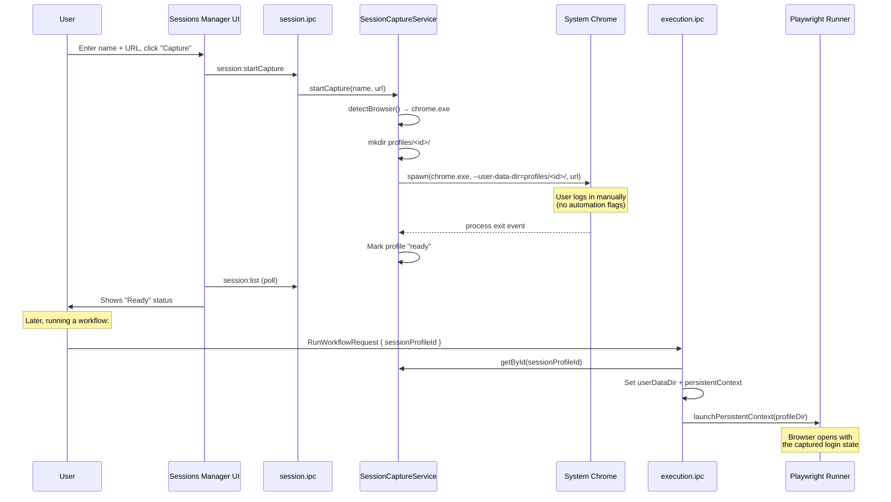

# Session Capture Browser — Walkthrough

## What Changed

Implemented a **Session Capture Browser** feature that lets users log into protected sites (Google, Microsoft, Cloudflare-gated) by launching their real system Chrome/Edge — not Playwright's automation Chromium — then reuse that login session in automation runs.

### Why System Chrome?

When Playwright launches Chromium, it sets automation flags (`navigator.webdriver = true`, CDP domains, distinctive TLS fingerprint) that sites detect and block. By spawning the user's real Chrome with a custom `--user-data-dir` and no automation flags, the login page sees a completely normal browser.

## New Files

| File | Purpose |
|---|---|
| [SessionProfile.ts](file:///c:/Users/moham/OneDrive/Desktop/AWTKIT/src/session/SessionProfile.ts) | Type definitions: `SessionProfile`, `SessionCaptureStatus`, `DetectedBrowser` |
| [SessionCaptureService.ts](file:///c:/Users/moham/OneDrive/Desktop/AWTKIT/src/session/SessionCaptureService.ts) | Core service: detect Chrome/Edge, manage profile dirs, launch browser, monitor process |
| [session.ipc.ts](file:///c:/Users/moham/OneDrive/Desktop/AWTKIT/app/main/ipc/session.ipc.ts) | 9 IPC handlers + `getSessionService()` singleton export |
| [SessionsManager.tsx](file:///c:/Users/moham/OneDrive/Desktop/AWTKIT/app/renderer/pages/SessionsManager.tsx) | Full Sessions Manager page with capture form, status, and saved sessions table |

## Modified Files

| File | Change |
|---|---|
| [index.ts](file:///c:/Users/moham/OneDrive/Desktop/AWTKIT/app/main/ipc/index.ts) | Register `registerSessionIpc()` |
| [preload.ts](file:///c:/Users/moham/OneDrive/Desktop/AWTKIT/app/main/preload.ts) | Add `session.*` namespace to `playwrightFlowStudio` API |
| [InstanceConfig.ts](file:///c:/Users/moham/OneDrive/Desktop/AWTKIT/src/instances/InstanceConfig.ts) | Add `sessionProfileId?: string` |
| [execution.ipc.ts](file:///c:/Users/moham/OneDrive/Desktop/AWTKIT/app/main/ipc/execution.ipc.ts) | Add `sessionProfileId` to `RunWorkflowRequest`, add `resolveInstanceTemplate()` |
| [InstanceManager.ts](file:///c:/Users/moham/OneDrive/Desktop/AWTKIT/src/instances/InstanceManager.ts) | Prefer template `userDataDir` over per-instance path |
| [routes.tsx](file:///c:/Users/moham/OneDrive/Desktop/AWTKIT/app/renderer/routes.tsx) | Add `sessions` route |
| [LeftNavigation.tsx](file:///c:/Users/moham/OneDrive/Desktop/AWTKIT/app/renderer/layout/LeftNavigation.tsx) | Add sessions to Data nav group |
| [CURRENT_STATE.md](file:///c:/Users/moham/OneDrive/Desktop/AWTKIT/docs/ai/CURRENT_STATE.md) | Document feature |
| [TASK_LOG.md](file:///c:/Users/moham/OneDrive/Desktop/AWTKIT/docs/ai/TASK_LOG.md) | Append entry |

## End-to-End Flow

## Validation Results

- **`npm run build`**: ✅ TypeScript clean, all bundles compiled
- **`npm run verify:runner`**: ✅ 44/44 tests passed (no regressions)

## Manual Testing Needed

1. **Capture flow**: Open Sessions Manager → capture a session → verify Chrome opens without automation flags → log in → close → verify profile shows "Ready"
2. **Reuse flow**: Run a workflow with the captured session → verify automation browser has the login state
3. **Edge detection**: Test on machines with Edge but no Chrome, and vice versa
