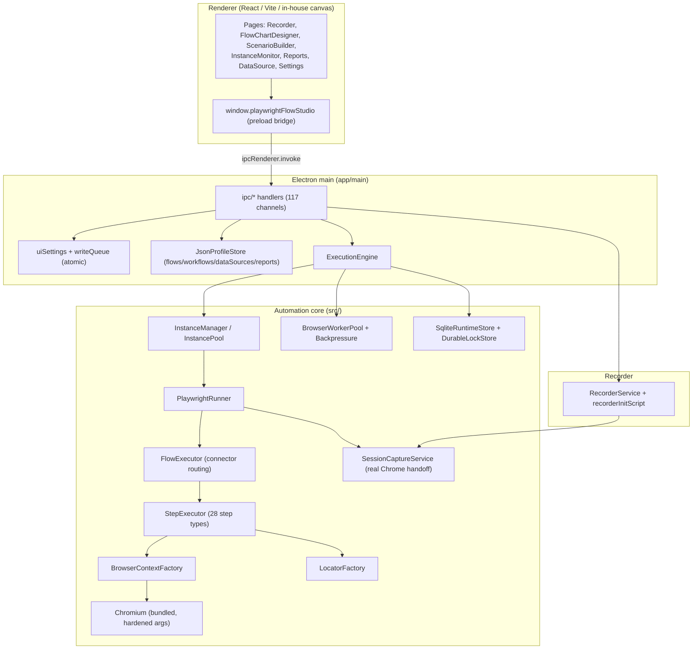

# CODEBASE_AUDIT — WebFlow Studio (AWKIT)

**Audit date:** 2026-07-12
**Branch:** `feature/smart-wait-engine`
**Reviewer role:** Principal Architect / TS / Electron / Playwright / QA / Security (single evidence-based pass)
**Scope note:** This is a **bounded, evidence-first** audit. The repository is large (242 TS/TSX
source files, ~37k LOC in `src/` + `app/`, 47 verification scripts). Every finding below is anchored to
a specific file/line and was read in this session. Areas not exhaustively line-read are labelled
*"suspected / needs runtime validation"* and are **not** counted as confirmed defects.

---

## 1. Executive summary

WebFlow Studio is a **mature, well-architected** offline Electron + React + Playwright automation
studio. The engineering quality of the runtime core is high: bounded browser worker pool, backpressure,
durable SQLite runtime store, cross-process file locks, hard cancellation, retry classification, and a
large bespoke `verify:*` regression suite. The Electron security posture is correct
(`contextIsolation: true`, `nodeIntegration: false`, a single typed preload bridge). The build is green.

The **most material risk is data integrity in the primary document store**: unlike the settings store
(which was explicitly hardened with a serial queue + atomic temp-file+rename), the JSON profile store
that persists the user's **flows, workflows, data sources, and reports** writes non-atomically and
**silently drops corrupt files**. This is the highest-value area to fix and is the recommended first
remediation phase.

No critical security defect, no crash-on-startup, and no core-feature-completely-broken condition was
found. Findings are concentrated in **persistence robustness**, **a small number of browser-lifecycle
edge cases**, **honestly-incomplete sub-features** (Load Session), and **maintainability/observability**.

### Health assessment

| Dimension | Rating | Note |
|---|---|---|
| Architecture | Strong | Clean `src/` core / `app/` shell split; documented data flow |
| Runtime/concurrency engine | Strong | Pool + backpressure + durable store + cancellation |
| Electron security | Strong | Isolation on, typed preload, external-link deny handler |
| Persistence integrity | **Weak spot** | Non-atomic profile writes; silent corrupt-file drop |
| Browser lifecycle | Good, minor gaps | One non-atomic cleanup ordering path |
| Feature completeness | High | All node types have runtime cases; 1 honest gap (Load Session) |
| Tests/verification | Broad but bespoke | 47 `verify:*`; no `test`/`lint`; heavy live/GUI reliance |
| Build/packaging | Green (dev build) | Packaging not re-run here (Windows/offline gated) |
| Documentation | Accurate but bloated | `CURRENT_STATE.md` 1521 lines, duplicated headers |

**Overall project health: 7.5 / 10.**

---

## 2. Architecture overview

Electron main process (`app/main`) hosts IPC handlers (`app/main/ipc/*`), profile stores, the settings
store, and the execution engine bridge. The renderer (`app/renderer`, React + Vite + an in-house canvas
engine) talks only through the `window.playwrightFlowStudio` preload contract (117 registered IPC
channels). The framework-agnostic automation core lives in `src/` (runner, orchestrator, concurrency,
durable store, recorder, session, profiles). Persistence is JSON files under the runtime data root
(`%LOCALAPPDATA%/WebFlow Studio/`) plus a durable `runtime.sqlite` (sql.js WASM) for run telemetry/locks.

Traced end-to-end flows (code-confirmed): app startup + durable-runtime init; flow/workflow save
(via `JsonProfileStore`); recording → `buildRecordedFlow`; run dispatch (`ExecutionEngine.startRun` →
`InstanceManager` → `PlaywrightRunner.executeScenario` → `FlowExecutor.executeFlow` →
`StepExecutor.execute`); connector routing (conditional→parallel→loop→legacy); browser launch/teardown
(`BrowserContextFactory`); session capture/reuse (`executeReuseSession`, `executeAutoSecureLogin`);
manual-login handoff; live progress → reports; and the offline hardening path.

---

## 3. Reviewed areas & method

- **Read in full:** `package.json`, `windowManager.ts`, `preload.ts`, `auth.ipc.ts`,
  `BrowserContextFactory.ts`, `ProfileStore.ts`, `FlowProfile.ts` (StepType), plus targeted regions of
  `StepExecutor.ts` (step switch, wait dispatch, routeChange, reuseSession) and `ARCHITECTURE.md` /
  `CURRENT_STATE.md`.
- **Static scans (repo-wide):** TODO/FIXME/HACK/placeholder/NotImplemented; `@ts-ignore`/`@ts-expect-error`/
  `eslint-disable`/`.skip(`/`.only(`; empty `catch {}`; Electron `webPreferences`/`openExternal` usage;
  `throw new Error` density.
- **Contract diff:** 117 registered IPC channels vs the preload API surface.
- **Commands run:** `npm run build` (pass), `npm run verify:write-queue` (7/7),
  `npm run verify:workflow-sentinels` (4/4). See `AUDIT_COMMAND_RESULTS.md`.

---

## 4. Confirmed findings (summary)

See `TECHNICAL_DEBT_REGISTER.md` and `UNIMPLEMENTED_FEATURES.md` for full detail. IDs are stable.

| ID | Sev | Confidence | Category | Summary |
|----|-----|-----------|----------|---------|
| A1 | Medium | Confirmed | Persistence | `JsonProfileStore.writeProfile` writes non-atomically (no temp+rename) — crash mid-write corrupts flow/workflow/data JSON |
| A2 | Medium | Confirmed | Persistence | `readProfileFile` silently returns `null` on corrupt JSON → the flow/workflow vanishes from the library with no error |
| A3 | Medium | Confirmed | Persistence | `update()` with id rename does non-atomic delete-then-write; no referential-integrity update for referencing workflows |
| A4 | Low | Confirmed | Runtime lifecycle | Isolated-context `close()` lacks try/finally — a throwing `context.close()` skips `browser.close()` → orphan browser |
| A5 | Low | Confirmed | Security | `setWindowOpenHandler` opens **any** URL scheme via `shell.openExternal` without the http(s) guard used elsewhere |
| A6 | Low | Confirmed | IPC/feature | ~16 IPC handlers (`instances:*` CRUD, `runtimeInputs:*` CRUD, `reports:create/delete/export`, `flow:list`) registered but not exposed in preload — dead or incomplete surface |
| A7 | Low | Confirmed (honest) | Unimplemented feature | "Load Session" (reuse saved storageState in a new run) is not implemented; honestly disabled in UI + capability flags |
| A8 | Low | Confirmed | Performance/build | Renderer ships one 1.28 MB JS chunk (> Vite 500 kB warn); no code-splitting |
| A9 | Info | Confirmed | Docs/maintainability | `docs/ai/CURRENT_STATE.md` is 1521 lines with duplicated section headers; hard to use as "live status" |
| A10 | Info | Confirmed | Testing | No `test`/`lint` npm scripts; verification is 47 bespoke `verify:*` scripts, many live/GUI, not CI-headless friendly |

**Severity totals:** Critical 0 · High 0 · Medium 3 · Low 5 · Informational 2.

---

## 5. Release blockers

**None are hard blockers**, but **A1 + A2 + A3 (persistence integrity) should be fixed before a GA
release** because they can silently lose or corrupt the user's saved automation documents — the core
asset the product exists to protect. They are Small-to-Medium effort and share a root cause (the profile
store never received the atomic-write/queue hardening that the settings store did).

---

## 6. Risks

- **Persistence (highest):** non-atomic writes + silent corrupt-file drop in the document store.
- **Architectural:** the automation core is excellent but the **verification strategy is bespoke and
  live-heavy** — regressions in refactors are caught by scripts that need real Electron/Playwright, so
  there is limited fast, headless, assertion-based safety net (A10).
- **Runtime:** browser-process orphan on a specific isolated-context teardown error path (A4).
- **Maintainability:** documentation volume/duplication (A9) raises the cost of onboarding and of
  keeping "current state" trustworthy.

---

## 7. Strengths (do not regress)

- Correct Electron isolation and a single typed preload bridge (`preload.ts`).
- Deep, thoughtful concurrency/stability stack: `BrowserWorkerPool`, `BackpressureController`,
  generation-scoped crash accounting, `ProfileLockManager` (in-process + durable cross-process),
  hard cancellation via `CancellationTokenSource`, retry classification.
- Settings persistence already hardened (serial queue + atomic temp+rename + before-quit flush) — this
  is exactly the pattern the profile store should adopt.
- Complete runtime coverage of all 28 `StepType`s (no UI-only node types found).
- Offline-first discipline (bundled Chromium resolver, Chromium egress hardening, dependency manifest).
- Recorder locator generation with ranked alternatives + container scoping + runtime self-healing.
